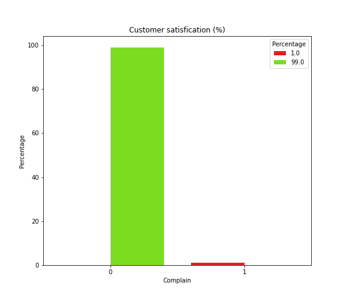
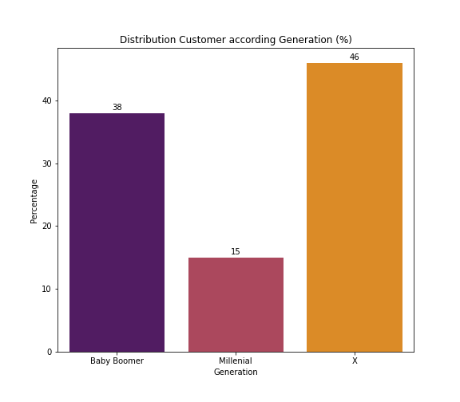
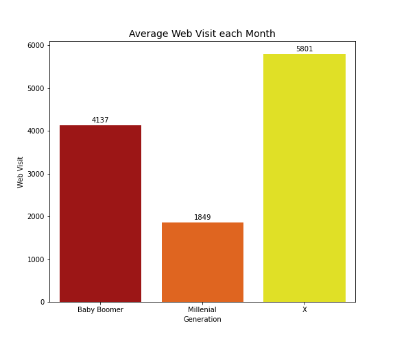
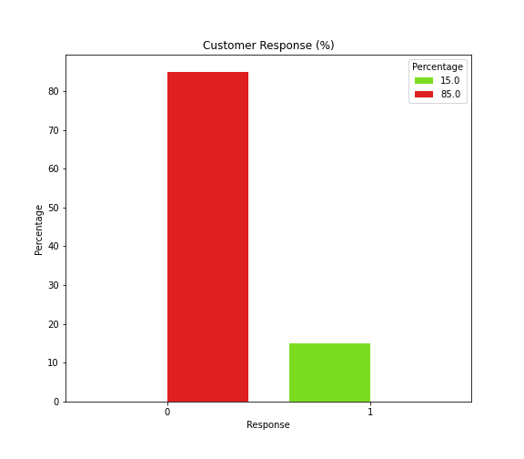
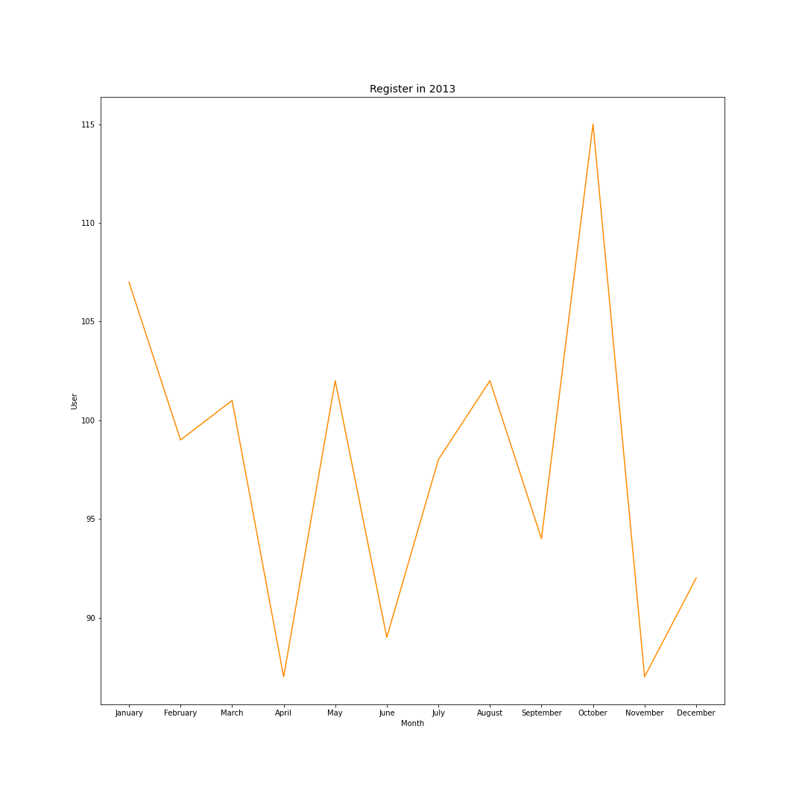

# Exploratory Data Analysis Marketing Analytics at XYZ Company 

## Business Problem 

<h3> Saat ini memasarkan produk belum sesuai target pangsa pasar </h3>

## Business Goal 

<h3> Mengetahui perilaku customer sehingga dapat memasarkan tepat sasaran  </h3>

## Business Impact 

<h3> Marketing & Sales Promotion </h3>

## Bussiness Question

## 1. Tingkat Kepuasan Customer 

</img>

<h3> Tingkat kepuasan customer tersebut mencapai 99%  </h3>

## 2. Sebaran customer berdasarkan generasi 

 </img>

<h3> Generasi X merupakan customer yang terbanyak mencapai 46%  </h3>

## 3. Kunjungan user ke website setiap bulan 

 </img>

<h3> customer mengakses website 1800 - 5801x setiap bulan </h3>

## 4. Response Customer 

</img>

<h3> Tingkat response customer masih 15% </h3>

## 5. Transaksi ditahun 2013

</img>

<h3> Register pada market tertinggi dibulan Oktober sedangkan terendah dibulan april dan november  </h3>

## Recommendation & Solution 

<h3> Perlu dimana ada rekomendasi penerapan digital campaign untuk meningkatkan customer  </h3>
